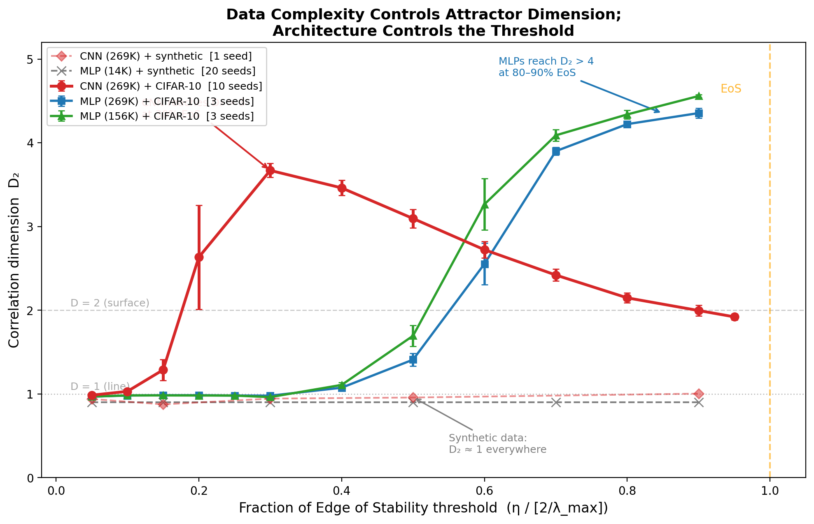
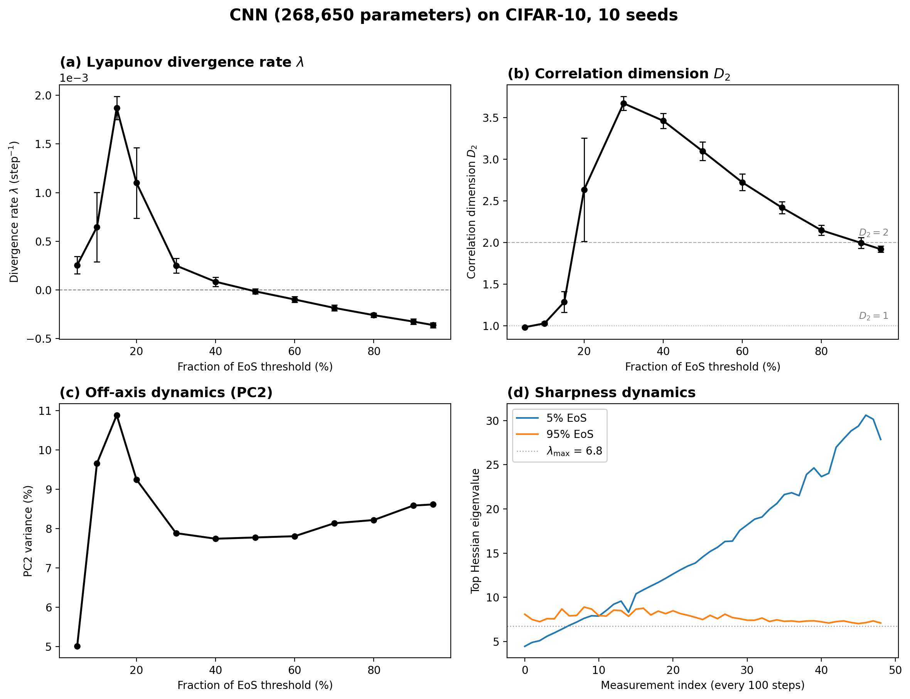
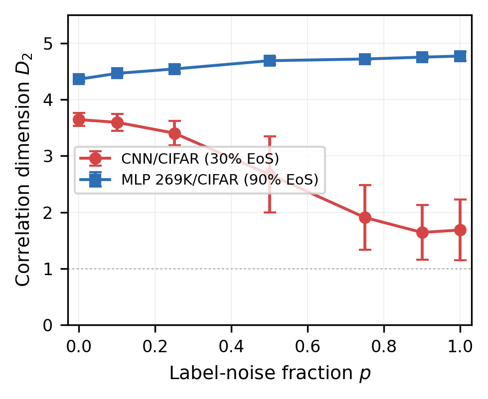

<p align="center">
  
</p>

<h1 align="center">Strange Attractors in Gradient Descent</h1>

<p align="center">
  <em>Data structure and loss geometry control the fractal dimension of training dynamics</em>
</p>

<p align="center">
  <a href="https://arxiv.org/abs/XXXX.XXXXX"></a>
  <a href="#license"></a>
  <a href="#license"></a>
</p>

---

## Overview

Neural network training trajectories in function space are **strange attractors**. We measure the [Grassberger–Procaccia correlation dimension](https://en.wikipedia.org/wiki/Correlation_dimension) *D*₂ of these trajectories under full-batch gradient descent and find:

| Finding | Detail |
|:--------|:-------|
| **Fractal training dynamics** | A CNN on CIFAR-10 produces an attractor with *D*₂ ≈ 5 (converged); conservative lower bound *D*₂ = 3.67 ± 0.08 |
| **Data is necessary** | Either architecture on structureless synthetic data gives *D*₂ ≈ 1 — no multi-dimensional chaos |
| **Two control mechanisms** | At moderate learning rates, structured labels create the oscillatory modes; near the Edge of Stability, loss-surface roughness sustains chaos independently |
| **Robust to SGD** | The attractor retains > 82% of its fractal dimension at 20× gradient noise |

**Paper:** Evan Paul, *Strange Attractors in Gradient Descent: Data Structure and Loss Geometry Control Fractal Dimension* — submitted to Physical Review Letters.

<details>
<summary><strong>Key figures</strong></summary>
<br>

**Figure 1** — CNN on CIFAR-10: Lyapunov divergence rate, correlation dimension, off-axis dynamics, and sharpness across learning rates.



**Figure 3** — Label-noise sweep reveals regime-dependent control. *D*₂ falls with label noise at 30% EoS (CNN) but rises at 90% EoS (MLP).



</details>

---

## Quickstart

### Requirements

Python ≥ 3.9 with:

```
torch >= 2.0
torchvision
numpy
scipy
matplotlib
ripser          # for persistent homology
```

Install:

```bash
pip install torch torchvision numpy scipy matplotlib ripser
```

### Run the core experiment

```bash
# CNN on CIFAR-10, single seed — takes ~5 min on GPU
python code/revision1/r1_cross_experiments.py --condition cnn_cifar --seeds 0 --quick
```

### Build the paper

Requires a TeX distribution with `revtex4-2` (included in MacTeX and `texlive-publishers`):

```bash
cd paper
pdflatex prl_attractor && bibtex prl_attractor && pdflatex prl_attractor && pdflatex prl_attractor
pdflatex supplemental && bibtex supplemental && pdflatex supplemental && pdflatex supplemental
```

---

## Reproducing all results

Every experiment uses full-batch gradient descent, MSE loss, no momentum, no weight decay, on a 2,000-image CIFAR-10 subset. Learning rates are expressed as fractions of the Edge of Stability threshold 2/λ_max.

### Cross-architecture experiments (10 seeds each)

```bash
# MLP (156K params) on CIFAR-10
python code/revision1/r1_cross_experiments.py --condition mlp_cifar_w50 --seeds 0 1 2 3 4 5 6 7 8 9

# MLP (269K params) on CIFAR-10
python code/revision1/r1_cross_experiments.py --condition mlp_cifar_w85 --seeds 0 1 2 3 4 5 6 7 8 9

# CNN on synthetic data (structureless control)
python code/revision1/r1_cross_experiments.py --condition cnn_synthetic --seeds 0 1 2 3 4 5 6 7 8 9

# Merge all seeds into unified data files
python code/revision1/r1_merge.py
```

### Supplemental experiments

```bash
# D₂ pipeline calibration (Lorenz, Hénon, Mackey-Glass, tori)
python code/revision1/r1_calibration_n400.py

# D₂ convergence with trajectory length (GPU)
python code/revision1/r1_d2_convergence.py

# Persistent homology for MLPs (GPU + ripser)
python code/revision1/r1_tda_mlp_cifar.py

# Perturbation sensitivity audit (ε, N_inputs)
python code/revision1/r1_lyap_units_check.py

# Label-noise sweep — 42 GPU runs
python code/revision1/r1_label_noise_sweep.py

# λ–D₂ dissociation analysis (CPU only)
python code/revision1/r1_dissociation_analysis.py

# Batch-size sweep (SGD robustness)
python code/revision1/r1_batch_size_sweep.py
```

### Generate figures

```bash
python code/revision1/r1_figure2.py                  # Fig. 2: cross-experiment D₂
python code/revision1/r1_label_noise_figure.py        # Fig. 3: label-noise sweep
python code/revision1/r1_d2_convergence_figure.py     # SM: D₂(N) convergence
python code/revision1/r1_persistence_figure.py        # SM: persistence diagrams
python code/revision1/r1_dissociation_analysis.py     # SM: λ–D₂ dissociation
python code/revision1/r1_batch_size_figure.py         # SM: batch-size sweep
```

---

## Repository structure

```
attractor/
├── paper/
│   ├── prl_attractor.tex            main manuscript (RevTeX 4.2)
│   ├── supplemental.tex             supplemental material
│   ├── cover_letter.tex             PRL cover letter
│   ├── references.bib               bibliography
│   └── figures/                     all publication figures
│
├── code/
│   ├── phase3_experiments_k.py      original CNN/CIFAR-10 experiments
│   ├── cnn_seeds_v2.py              CNN multi-seed (seeds 0–2)
│   ├── cnn_seeds_extension_fixed.py CNN extension (seeds 3–9)
│   ├── experiment_L_tda_fixed.py    original persistent homology
│   └── revision1/                   all revision experiments & figures
│
├── data/
│   ├── main/                        data backing main-text results
│   │   └── revision1/               10-seed merged data, label-noise sweep
│   ├── supplemental/                data backing supplement tables
│   │   └── revision1/               calibration, TDA, convergence, dissociation
│   └── phase1_phase2/               early exploration (read-only archive)
│
└── docs/                            internal notes and drafts
```

All data files are JSON. Each contains metadata (protocol hash, git commit, torch version, seed list) for full reproducibility.

---

## Methods at a glance

**Chaos measurement.** Two model copies train from identical initialization; one is perturbed by ε = 10⁻⁵ in weight space. The divergence rate λ is measured in *function space* (on held-out inputs) to avoid gauge artifacts from weight-space symmetries in overparameterized networks.

**Correlation dimension.** *D*₂ is computed via the Grassberger–Procaccia algorithm on ~400 function-space trajectory points. The pipeline is calibrated against 11 known dynamical systems (Lorenz, Hénon, Rössler, Mackey-Glass, smooth tori) at the production trajectory length; reported values are conservative lower bounds (15–35% systematic underestimate for fractal attractors).

**Topological confirmation.** Persistent homology (ripser) independently confirms fractal structure: hundreds of H₁ features at all persistence scales with gap ratio ≈ 1.0 — the signature of a strange attractor, not a smooth torus.

---

## Citation

```bibtex
@article{paul2026attractors,
  author  = {Paul, Evan},
  title   = {Strange Attractors in Gradient Descent: Data Structure and
             Loss Geometry Control Fractal Dimension},
  journal = {Physical Review Letters},
  year    = {2026},
  note    = {Submitted}
}
```

---

## License

Code is released under the [MIT License](https://opensource.org/licenses/MIT). The paper, figures, and data are released under [CC-BY 4.0](https://creativecommons.org/licenses/by/4.0/).

---

<p align="center">
  <sub>AI language models (Claude, Anthropic) were used as research tools in this work. See the manuscript acknowledgments and cover letter for a full disclosure. All scientific conclusions are the author's sole responsibility.</sub>
</p>
